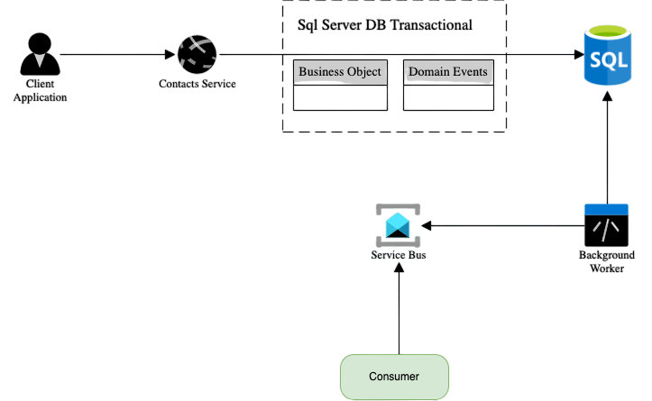

# Transactional Outbox pattern

Microservice architectures are gaining popularity due to their ability to address scalability, maintainability, and agility challenges, particularly in large applications. However, this architectural pattern also introduces new considerations when it comes to data handling. In distributed applications, each service maintains its own dedicated datastore, which can pose challenges in ensuring data consistency and synchronization across services.

To tackle these challenges, it is common to employ a messaging solution such as RabbitMQ, Kafka, or Azure Service Bus. These messaging systems facilitate the distribution of data (events) from one service to others via a messaging bus. By leveraging this approach, services can communicate and share data efficiently, ensuring that relevant information is propagated to the necessary consumers.

One illustrative example of this pattern is an ordering system. Let's consider a scenario where a user intends to create an order. In this case, an Ordering service receives data from a client application through a REST endpoint. The service then maps the payload to an internal representation of an Order object and performs data validation. Once the data is successfully committed to the database, the `Ordering Service` publishes an `OrderPlaced` event to the message bus.

Other services within the application, such as an `Inventory` or `Invoicing` service, can subscribe to the `OrderPlaced` messages. By doing so, they become aware of newly placed orders and can process and store the relevant data in their own dedicated databases. This decentralized approach allows different services to react to events and maintain their own copies of data as needed.

By employing messaging systems and event-driven architectures, microservice-based applications can efficiently distribute data and ensure that services are informed of changes in a timely manner. This enables better coordination and collaboration between services while maintaining data consistency across the application.


## First problem


```c#
 public async Task HandleAsync(PlaceOrderCommand command, 
        CancellationToken cancellationToken = new())
{
     var options = OrderFactory.CreateFrom(command);

     var order = Order.PlaceOrder(options);

     await _repository.AddAsync(order);
     
     await _publisher.PublishAsync(new OrderPlaced(options.Id));
}
```

This approach works well until an error occurs between saving the order object and publishing the corresponding event. Sending an event might fail at this point for many reasons:

- Network errors
- Message service outage
- Host failure

## Solutions

There's a well-known pattern called `Transactional Outbox` that can help you avoid these situations. It ensures events are saved in a datastore (typically in an Outbox table in your database) before they're ultimately pushed to a message broker. If the business object and the corresponding events are saved within the same database transaction, it's guaranteed that no data will be lost. Everything will be committed, or everything will roll back if there's an error. To eventually publish the event, a different service or worker process queries the Outbox table for unhandled entries, publishes the events, and marks them as processed. This pattern ensures events won't be lost after a business object is created or modified.


## Implementation



## Second problem


## Delivery Semantics

- At-most-once (Potentially data lost and best performace)
- At-least-once (Consumer might get duplicate messages - reasonable performance and easy to handle)
- Exactly-once (Most Expensive)

Main issue in At-least-once is Duplication.


# Message Processning

Idempotency is a property of operations or API requests that ensures repeating the operation multiple times produces the same result as executing it once

- f(f(x)) = f(x)
- Absolute value: |x|
- Delete in Sql
    ```sql
      Delete * From Customers Where Id = 1
    ```
        

### Idempotent Consumer

 1. Expilict De-duplication
 2. Semantic (better performace and schala)


## Expilict De-duplication With AOP (Aspect Oriented Programming) Solution

```csharp
public class IdempotentMessageHandler<T> : IConsumer<T> where T : DomainEvent
{
    private readonly IUnitOfWork _unitOfWork;
    private readonly IDuplicateHandler _duplicateHandler;
    private readonly IServiceProvider _serviceProvider;
    private readonly ILogger<IdempotentMessageHandler<T>> _logger;


    public IdempotentMessageHandler(IUnitOfWork unitOfWork, IDuplicateHandler duplicateHandler,
        IServiceProvider serviceProvider, ILogger<IdempotentMessageHandler<T>> logger)
    {
        _unitOfWork = unitOfWork;
        _duplicateHandler = duplicateHandler;
        _serviceProvider = serviceProvider;
        _logger = logger;
    }

    public async Task Consume(ConsumeContext<T> context)
    {
        if (await _duplicateHandler.HasMessageConsumedBeforeAsync(context.Message.EventId))
        {
            _logger.LogInformation("{Type}-{MessageEventId} has been already consumed",
                context.Message.GetType(), context.Message.EventId);
            return;
        }

        try
        {
            await _unitOfWork.BeginAsync();

            var consumer = _serviceProvider.GetService<IMessageConsumer<T>>();
            if (consumer is null)
            {
                _logger.LogError("Type of \'{Type}\' not found in event types", typeof(T));
                throw new ArgumentException($"There is no consumer for {typeof(T)}");
            }

            await consumer.Consume(context);

            await _duplicateHandler.MarkMessageConsumed(context.Message.EventId);

            await _unitOfWork.CommitAsync();
        }
        catch (Exception exception)
        {
            await _unitOfWork.RollbackAsync();
            throw new Exception(exception.Message, exception);
        }
    }
}
```

### Place Order example 

```csharp
public class OrderPlacedConsumer : IMessageConsumer<OrderPlaced>
{
    private readonly ILogger<OrderPlacedConsumer> _logger;

    public OrderPlacedConsumer(ILogger<OrderPlacedConsumer> logger)
    {
        _logger = logger;
    }

    public Task Consume(ConsumeContext<OrderPlaced> context)
    {
        _logger.LogInformation($"Order '{context.Message.EventId}- Consumed");
        return Task.CompletedTask;
    }
}
```